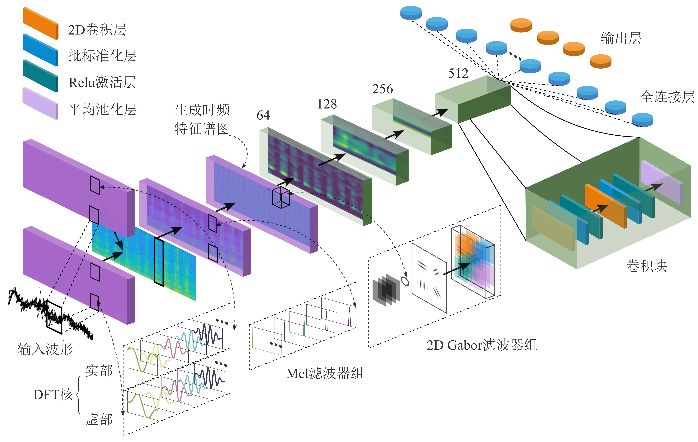

# Gf+

This repo contains code for my thesis: **Ship-radiated noise recognition using spectrogram**. 
- A mean average precision (mAP) of 71.6% is achieved using our proposed Gf+ system, outperforming the Cnn10 baseline of 64.1%.
- A total number of parameters in a PyTorch model is only increased by 1.06M.
- Allows on-the-fly spectrogram extraction and fine-tuning.

## Environments
The codebase is developed with `Python 3.7` `cuda 10.1` 

## Gf+ model
The visualization of general framework looks like:




## Train models from scratch

### 1. Download dataset
Please see [data/readme.md](./data/readme.md) for details of Email.

### 2. Pack waveforms into hdf5 files
The [utils/prepdata.py](utils/prepdata.py) script is used for packing all raw waveforms into hdf5 files for speed up training and divide them into 4 folds. The data files looks like:

<pre>
data
└── DeepShip
     ├── class1
     |    ├── d1
     |    ├── ...
     |    └── dx
     |        ├── 0001.wav
     |        ...
     |        └── 000x.wav
     └── classx
</pre>
The [utils/prepdemon.py](utils/prepdemon.py) script is used for generating the demon spectrogram, everything else is the same.

### 3. Train
The [train.sh](./train.sh) script contains training, saving checkpoints, and evaluation.

```
python pytorch/main.py train \
    --workspace=$WORKSPACE \
    --hdf5_path=$DATA_DIR \
    --holdout_fold=4 \
    --model_type='Cnn10_gf' \
    --loss_type=clip_bce \
    --augmentation='none' \
    --learning_rate=1e-4 \
    --batch_size=16 \
    --stop_iteration=2000 \
    --feature_name='mel' \
    --learnable='none'
```

## Results
The CNN models are trained on a single card V100-SXM2-32GB. The training takes around 3 - 5 hours.

Wandb have been used for experiments recording. Please check https://wandb.ai/pretty1sky/Features_try?workspace=user-pretty1sky.

The variation of the mAP of CNN10 and Gf with the number of iterations under four different features before and after fine-tuning learnable parameter:


## Demos
We apply the audio tagging system to build a sound event detection (SED) system.

The demo code is available at https://github.com/yinkalario/General-Purpose-Sound-Recognition-Demo.

## Acknowledgement
We appreciate the open source of the following projects:<br>
[Gabor Convolutional Networks](https://github.com/jxgu1016/Gabor_CNN_PyTorch)   [PANNs](https://github.com/qiuqiangkong/audioset_tagging_cnn)   [nnAudio](https://github.com/KinWaiCheuk/nnAudio) 

We appreciate the open source of the following datasets:<br>
[DeepShip](https://github.com/irfankamboh/DeepShip)   [ShipsEar](https://atlanttic.uvigo.es/underwaternoise/)   [AudioSet](https://research.google.com/audioset/dataset/ship.html)
